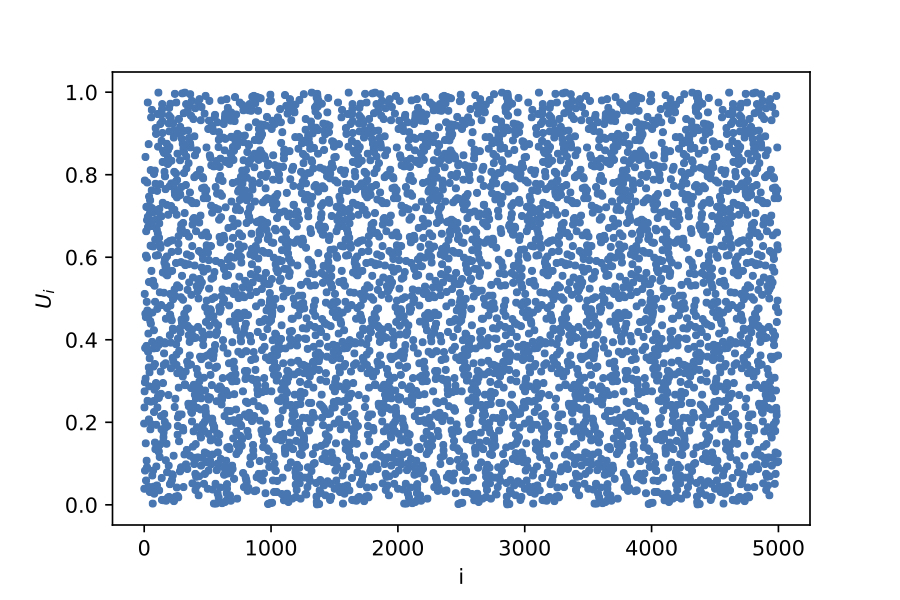
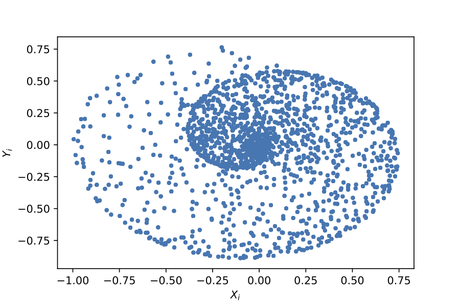
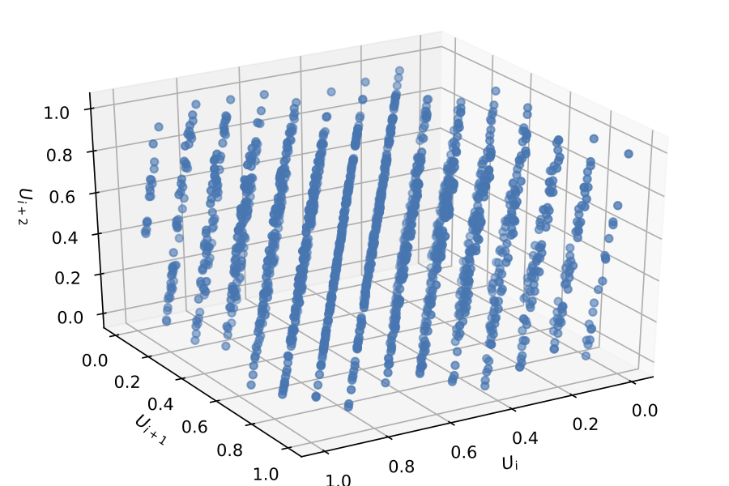
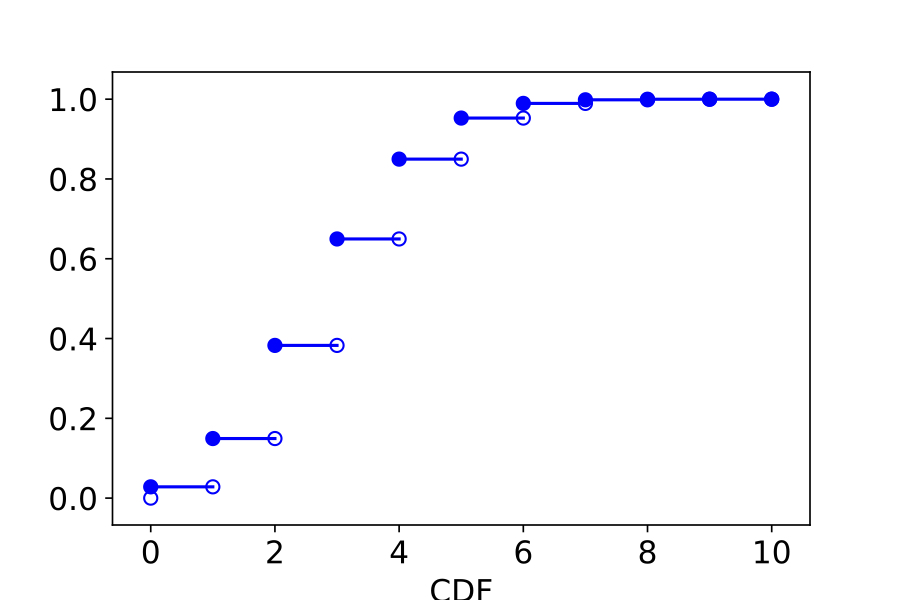
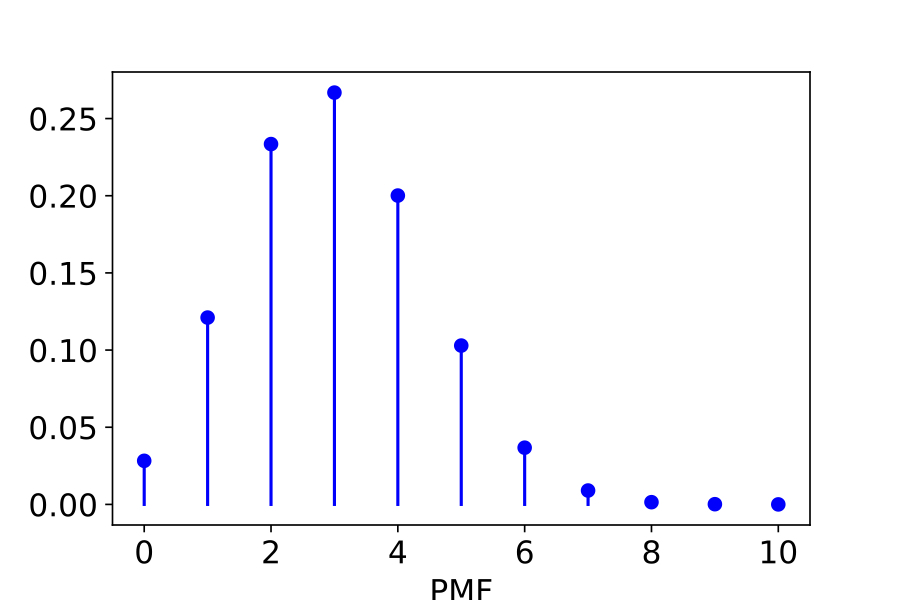

# 随机数和随机梯度下降法

## 伪随机数的产生

我们称计算机算法产生的随机数为伪随机数。伪随机数在分布特性上接近真随机数，因此在一些随机模拟的算法中可以代替真随机数提供随机性。但要注意，计算机作为一个确定性系统，通过算法产生的伪随机数永远也不可能是真随机数，也就是实际上，它是有规律的，只是这种规律可能由于信息不对成，埋藏的比较深。伪随机数的统计学特征越接近真随机数，我们称它的质量越好。高质量的伪随机数，必然需要更大的计算代价。所以很多时候，我们需要根据实际问题的需求来选择合适的随机数生成器。

Tezuka 1995 提出伪随机数应该具有如下特点：

+ 能通过统计检验；
+ 有数学理论支撑；
+ 可以递推产生，不用占用大量内存；
+ 产生速度快，效率高；
+ 重复周期长，至少有$10^{50}$；如果问题需要$N$个随机数，则周期需要$2N^2$；
+ 并行性好，可在计算集群上快速产生；

**Fibonacci生成器**

最简单的随机数生成器，是Taussky和Todd于1956年提出的可以用加法同余产生在$[0, M-1]$均匀分布的伪随机整数，其递推公式为
$$
\begin{equation}
 X_i = (X_{i - 2} + X_{i - 1})\mod M, i > 2.
\end{equation}
$$
当$X_0 = X_1 = 1$时，该公式产生的序列在小于$M$部分就是Fibonacci序列，因此又称为经典Fibonacci产生器。该算法过程实现很简单。显然，$U_i = X_i / M$给出了相应的$U(0, 1)$分布随机数。这一算法我们一般用在对随机性要求较低的场合，比如建一张临时Hash表。

**线性同余生成器**

Lehmer 1951和Rotenberg 1960分别提出了乘同余和混合同余产生器。递推公式为：
$$
\begin{equation}
 X_i = (A * X_{i - 1} + C) \mod M,
\end{equation}
$$
其中参数$M$，$A$和$C$分别称为模，乘子和增量。当$C = 0$的特例即是乘同余产生器，而$C > 0$则称为混合同余产生器。同样可以用$U_i = X_i / M$将其调整为$U(0, 1)$分布。

显然，Fibonacci生成器是线同余生成器的一个特例。线性同余生成器的原理是大整数的同余计算在除数范围内近似均匀分布。它实现简单，并且长期被人们接受。比如线性同余方法曾经广泛使用于各个计算机平台做为伪随机数发生器。比如IBM360系统下曾有一个著名的随机数产生器RANDU被使用多年。它就是$A = 65539$，$M = 2^{31}$的线性乘同余产生器。

然而，研究发现线性同余生成器产生的伪随机数有严重的分布不均匀问题。

上图为一个加法同余产生器的均匀性测试，参数为 $X_0 = 197$，$X_1 = 39$，$M =                                       1000$，一共产生了5000个随机数。看上去觉得分布非常均匀，然而，在特殊的抽样公式
$$
\begin{eqnarray}
X_i & = & \sqrt{U_i} \cos(2 \pi U_{i + 1}) \sin(\pi U_{i + 2}), \quad 
Y_i & = & \sqrt{U_i} \sin(2 \pi U_{i + 1}) \sin(\pi U_{i + 2})
\end{eqnarray}
$$
下，我们看到$X_i$和$Y_i$与应有的统计预测不符：

稍微复杂一点的线性同余方法也有类似的问题，比如IBM360的RANDU产生的伪随机数序列$\{U_i\}, i = 0, 1, \cdots$，它的三重分布，即$(U_{i}, U_{i + 1}, U_{i + 2})$实际上只分布在15个空间平面上：
$$
\begin{equation}
9x - 6y + z = k, k = -5, -4, \cdots, 8, 9.
\end{equation}
$$
这一现象被称为降维，它导致随机数的高维分布均匀性消失。具体推导可参见：

https://en.wikipedia.org/wiki/RANDU}{https://en.wikipedia.org/wiki/RANDU

可以证明，降维现象是线性同余产生器的一个必然结果。一般地，对与线性同余产生器产生的伪随机点列构成的$s$维空间点列
$$
\begin{equation}
P = (U_i, U_{i + 1}, \cdots, U_{i + s - 1}), i = 1, 2, \cdots
\end{equation}
$$
只落在个数不超过$(s!M)^{1/s}$的彼此平行的超平面上（参见：Marsaglia 1968）。我们可以用数值试验重现上述结果，参见ex4_1，ex4_2等演示程序。

**非线性同余生成器**

因此如果我们需要更高质量的随机数，一个方法是进一步复杂化同余过程，并引入非线性算子。比如二次同余递推公式为：
$$
\begin{equation}
X_i = (A X_{i - 1}^2 + B X_{i - 1} + C) \mod M.
\end{equation}
$$
更多的内容可自行参考Fishman 1995。

目前我们在Gnu c++，Matlab，Python等平台采用的随机数生成器比上面提到的都要复杂得多，称为梅森旋转(Mersenne Twister)产生器。它基于四位日本数学家所发表的一系列论文：

+ Matsumoto（松本）& Kurita（栗田）1992，1994；
+ Matsumoto & Nishimura（西村） 1998，2000；
+ Matsumoto \& Saito（斋藤）2008。

它的一个重要实例就是MT19937，能提供周期长达$2^{19937}-1$，能通过目前几乎所有的随机数检验程序，且在至多623维空间分布均匀。MT19937是基于32位字长机器运算。最新的MT随机数生成器能提供更高机器字长的版本。参见：

http://www.math.sci.hiroshima-u.ac.jp/~m-mat/MT/emt.html

但即便如此，MT19937及其所有后续版本，也只是伪随机数。它的规律性只是隐藏的比较深而已，并不能用在国防、金融、博彩等关键性场合。在这些场景下，应该使用真随机数芯片来产生真随机数。

**真随机数生成器**

真随机数产生器是一种物理装置，它依赖客观世界中的真实随机现象如基本粒子的随机热运动，量子效应等来产生随机数。这种装置能产生几乎完美的随机数，但往往产生效率不高，且装置本身较为昂贵。一种可以考虑的方法是使用真随机

数产生器生成的随机数表。比如网站：

https://www.random.org

就提供这样的服务。

我们接下去主要利用随机数来进行随机模拟，在这个过程中，更重要的是随机数的均匀分布性，主要是在各阶数字特征上表现出足够的随机性即可，并不在意是否会被深层次的算法过程破解规律。同时，我们对随机数的实时产生效率要求较高，因此我们一般倾向于采用有一定质量的伪随机数。比如MT19937。这里指出，我们对伪随机数的质量并不是毫无要求。历史上曾经发生过这样的悲剧：物理学家采用IBM360体系的伪随机数进行晶体结构的随机模拟，结果由于我们之前提到过的RANDU伪随机数在三维空间实际上分布并不均匀，导致最终模拟得到的晶体出现了非自然的结构，一度对整个领域的研究造成了严重的困扰。

**随机性检测**

随机数的理论检测即从随机数的产生原理出发，寻找它的缺陷。比如之前的栅格现象等。实际上这种缺陷也是在应用过程中发现，才被人们所重视，并且在设计随机数产生器时格外注意。理论检验都只针对具体的产生原理，并没有一般性。更多的，我们需要用现代统计学手段对随机数的质量进行统计分析。较为一般的检验，可以是检查随机数的频率，频次，相关性，各阶矩等等。更复杂的检验，则要精确设计统计实验，并涉及到较为复杂和专业的统计学知识。目前被大家所接受的统计学检验程序是Marsaglia给出的DieHard程序。它由一系列精心设计的复杂统计实验组成，几乎是目前检测随机数质量的标准过程。George Marsaglia教授已于2011年去世，但DieHard程序仍然有人不断更新和维护，并引入了GPL协议使得可以公开下载和免费使用。具体可参见网站：

http://webhome.phy.duke.edu/\~rgb/General/dieharder.php

## 指定分布随机数生成

上一节讨论的最简单的随机数生成器其实就是均匀分布的随机数。为了能进一步模拟各种随机现象，我们需要能利用均匀分布随机数产生各种指定分布的随机数。我们这里只讨论最基本的思想方法，具体的程序在Matlab和各种软件中都是有提供的。

我们用概率分布来描述一个随机变量服从的分布规律，具体来说，离散型随机变量的概率分布称为

**定义 概率质量函数(Probability Mass Function, PMF)** 若离散型随机变量$\xi$取值为$x_1, x_2, \cdots, x_n$的概率分别为$p_1,
  p_2, \cdots, p_n$, 即
$$
\begin{equation}
    P(\xi = x_i) = p_i, i = 1, 2, \cdots, n,
  \end{equation}
$$
则其概率分布函数
$$
\begin{equation}
    f(x) = \left\{
    \begin{array}{ll}
      p_i, & x \in S,\\
      0, & x \in \mathbb{R}\setminus S,
    \end{array}\right.
  \end{equation}
$$
又称为概率质量函数，简称为PMF。其中$S = \{x_1, x_2, \cdots, x_n\}$称为样本集。显然，在离散的情形下，有
$$
\sum_{x_i \in S}p_i = \sum_{i = 1}^np_i = 1.
$$

**定义 累积分布函数(Cumulative Distribution Function, CDF)** 称
$$
\begin{equation}
    F(x) = P(\xi \leq x) = \sum_{x_i \leq x}p_i, x \in \mathbb{R}
  \end{equation}
$$
为累积分布函数，简称为CDF。

**例：两点分布** 最简单的两点分布的PMF为
$$
\begin{equation}
    f(x) = \left\{\begin{array}{ll}
    0.5, &x = 0; \\
    0.5, &x = 1;\\
    0, &x \notin \{0, 1\}.
    \end{array}\right.
  \end{equation}
$$
对应的CDF为
$$
\begin{equation}
    F(x) = \left\{\begin{array}{ll}
    0, & x < 0; \\
    0.5, &0 \leq x < 1; \\
    1, &x = 1.
    \end{array}\right.
  \end{equation}
$$
更常见的，离散型随机变量的特征会像下面那样表示。

**例：二项分布** PMF一般写做
$$
\begin{equation}
  b(k; n, p) = \binom{n}{k}p^k(1 - p)^{n - k}, 0 < p < 1, k = 0, 1, \cdots, n.
\end{equation}
$$
我们考虑$n = 10$，$p = 0.3$的特例，我们可以根据其PMF给出对应的二项分布表\ref{table::df_bin}，以及对应的图\ref{fig::DF_bin}。

| 二项分布      | $n = 10 $             | $p = 0.3 $             |
| ------------- | --------------------- | ---------------------- |
| $k $          | 0                     | 1                      |
| $P(\xi = k) $ | 0.028247524900000005  | 0.12106082100000018    |
| $k $          | 2                     | 3                      |
| $P(\xi = k) $ | 0.2334744405          | 0.26682793200000016    |
| $k $          | 4                     | 5                      |
| $P(\xi = k) $ | 0.20012094900000013   | 0.10291934520000007    |
| $k $          | 6                     | 7                      |
| $P(\xi = k) $ | 0.03675690899999999   | 0.009001692000000002   |
| $k $          | 8                     | 9                      |
| $P(\xi = k) $ | 0.0014467004999999982 | 0.00013778100000000015 |
| $k $          | 10                    |                        |
| $P(\xi = k) $ | 5.904899999999995e-06 |                        |

而对应的累积分布图为：

质量分布为：

随机模拟的一个重要步骤是根据需要产生服从各种分布的样本集。之前我们已经讨论过如何产生服从$U(0, 1)$的均匀分布的随机数，那么现在，我们就要从服从$U(0, 1)$的均匀分布的随机序列出发，产生独立同分布的目标随机数序列。这里两个问题的解决是各自独立的。首先随机序列的独立性完全由均匀分布的随机序列的独立性决定，这在上一章已经讨论。我们接下去主要讨论如何确保随机序列同分布，也即和要求的目标分布一致。这里还有一个重要问题是产生效率，因为我们必须在计算机上算法实现。

**直接抽样方法**

如果随机变量的PMF是已知的，那么我们可以从均匀分布的随机数出发，直接根据概率论定义构建抽样算法。这种方法称为直接抽样方法。即产生均匀分布的随机序列，然后通过某种变换或抽取，使得从中变换抽取后的随机数样本集$X$服从$F(x)$，这里$F(x)$是已知积累分布函数。也即要求$\forall \xi \sim F$，
$$
\begin{equation}
  P(\xi \leq x) = F(x), x \in \mathbb{R}.
  \end{equation}
$$
这里，一方面，我们要从算法保证（证明）$X$确实服从指定分布$F(x)$；另一方面，对于一个实际的产生的抽样结果，也要能通过指定的统计检验。

**逆变换算法**

1947年，曼哈顿计划的参与者Stanislaw Marein Ulam提出了逆变换算法，注意到随机变量$\xi$的累积分布函数
$$
F(x): \mathbb{R} \mapsto [0, 1]
$$
是非降的，故定义其逆函数为
$$
\begin{equation}
  F^{-1}: [0, 1] \mapsto \mathbb{R}, F^{-1}(y) = \inf \{x \left| F(x)
  \geq y \right.\},
  
\end{equation}
$$
并指出，若随机变量$\eta$服从$[0, 1]$上的均匀分布，$F(x)$是指定分布的CDF，令$\xi = F^{-1}(\eta)$，则$\xi$服从$F(x)$。所以我们算法的设计思路就是对一个均匀分布的随机数序列$U$，求其逆变换$X
= F^{-1}(U)$，则$X$的分布服从$F(x)$。

**列表查找法**
对离散分布，我们可以直接给出分布表。若离散分布的PMF表为
$$
\begin{array}{cccc}
  x_0 & x_1 & \cdots & x_n \\
  p_0 & p_1 & \cdots & p_n,
\end{array}
$$
且$x_0 < x_1 < \cdots < x_n$, 则我们不难构建CDF表
$$
\begin{array}{cccccc}
  x_0 & x_1 & \cdots & x_k & \cdots & x_n \\
  F_0 = p_0 & F_1 = p_0 +  p_1 & \cdots
  & F_k = \sum_{i = 0}^k p_i & \cdots & F_n \equiv 1.
\end{array}
$$
根据定义$\forall x \notin \{x_0, x_1, \cdots,
x_n\}$，有$f(x) = 0$，故我们可以认为$F_{-1} = 0$。现在对$\eta \sim U(0, 1)$，必有$0 \leq k \leq n$，满足
$$
\begin{equation}
  
F_{k - 1} < \eta \leq F_k,
\end{equation}
$$
则可取$\xi = x_k$。从PMF角度，就是
$$
\begin{equation}
  \xi = \min\left\{x_k\left|\eta \leq \sum_

{i = 0}^kf(x_i)\right.\right\}, \eta \sim U(0, 1).
  
\end{equation}
$$
在具体的抽取算法中，这一过程就是查表。对于较长的表，可以采用二分查找。

**连续分布的情形**
而对于连续型随机变量，可以看作是离散型随机变量的一种极限情形。这时可以做离散近似，或者对于一些基本分布，我们可以直接将这个极限计算出来，也就是积分，当然前提是要能够有有限形式的积分。首先我们引入

**定义：概率密度函数(Probability Density Function, PDF) ** 对连续型随机变量，$\forall x \in \mathbb{R}$, 我们仍称
$$
\begin{equation}
    F(x) = P(\xi \leq x), x \in \mathbb{R}
    
  \end{equation}
$$
为累计分布函数，若存在某个非负的可积函数$f(x)$，满足
$$
\begin{equation}
    F(x) = \int_{-\infty}^x f(y) dy, \forall x \in \mathbb{R},
    
  \end{equation}
$$
则称$f(x)$为对应随机分布的概率密度函数，简称为PDF。此时，
$$
\begin{equation}
    f(x) = F'(x).
    
  \end{equation}
$$
注意到我们之前定义的针对离散型随机变量的PMF，事实上和这里定义的PDF并无冲突，甚至可以看作是PDF的一个特例（这里要看你如何定义积分了）。关于逆变换的定义也可以完全沿用。对于连续分布的采样抽取，如果存在容易计算的逆变换解析表达式$F^{-1}(y)$，那么对于$U(0, 1)$的均匀分布的随机变量$\eta$，直接计算$F^{-1}(\eta)$即可。也就是说，
$$
\begin{equation}
  \xi = \min\left\{x \left|\eta \leq \int_{-\infty}^x f(t)
  dt\right.\right\} = F^{-1}(\eta), \eta \sim U(0, 1),
  
\end{equation}
$$
则$\xi \sim f(x)$。下表给出了常用分布及逆分布。

| 分布         | PDF                                                          | 逆变换                                  |
| ------------ | ------------------------------------------------------------ | --------------------------------------- |
| 均匀分布     | $\frac{1}{b - a}, x \in [a, b]$                              | $a + (b - a)y$                          |
| Rayleigh分布 | $\frac{x}{\sigma^2}e^{-\frac{x^2}{2\sigma^2}}, x > 0$        | $\sqrt{-2\sigma^2\ln y}$                |
| 指数分布     | $\frac{1}{\lambda} e^{-\frac{x}{\lambda}}, \lambda > 0, x \geq 0$ | $-\lambda\ln y$                         |
| Weibull分布  | $\frac{a}{b^a}x^{a - 1} e^{-\left(\frac{x}{b}\right)^a},   a, b > 0, x \geq 0$ | $b\left(-\ln y\right)^{\frac{1}{a}}$    |
| Beta分布     | $ax^{a - 1}, a > 0, x \in [0, 1]$                            | $y^{\frac{1}{a}}$                       |
| Beta分布     | $b(1 - x)^{b - 1}, b > 0, x \in [0, 1]$                      | $1 - y^{\frac{1}{b}}$                   |
| 逻辑分布     | $\frac{e^{-\frac{x - a}{b}}}{b\left[1 + e^{-\frac{x - a}{b}}\right]^2}, b > 0$ | $a + b \ln\left[\frac{y}{1 - y}\right]$ |
| Cauchy分布   | $\frac{b}{\pi\left[b^2 + (x - a)^2\right]}$                  | $a + \frac{b}{\tan(\pi y)}$             |
| 正态分布     | $\frac{1}{\sqrt{2\pi\sigma^2}}e^{-\frac{(x - \mu)^2}{2\sigma^2}}$ | 无                                      |
| Pareto分布   | $\frac{ab^a}{x^{a + 1}}, x \geq b > 0, a > 0$                | $\frac{b}{(1 - y)^{\frac{1}{a}}}$       |

从表上我们就发现并不是每一个能写出表达式的逆变换在计算上都是高效率的，而有的甚至根本没有解析形式。比如最重要的正态分布我们就没有解析的逆变换形式。不过Hastings 1955（这是一本神奇的书，给出了各种难以计算公式的有理逼近估计）给出了一个有理逼近形式：
$$
\begin{equation}
  F^{-1}(y) = \mu

  + \mathrm{sign}(y - \frac{1}{2})\sigma\left(t

  - \frac{c_0 + c_1 t + c_2 t^2}{1 + d_1 t + d_2 t^2 + d_3 t^3}\right),
    \end{equation}
$$
其中
$$
t = \sqrt{-\ln\left[\min(y, 1 - y)\right]^2},
$$
各参数值为
$$
\begin{array}{c}
  c_0 = 2.515517, c_1 = 0.802853, c_2 = 0.010328,\\
  d_1 = 1.432788, d_2 = 0.189269, d_3 = 0.001308.
\end{array}
$$
此公式绝对误差小于$0.45 \times 10^-3$。

## 随机梯度下降(Stochastic Gradient Descent)

这个弯转的有点大。我们讨论这么多随机性有什么用处呢？这里我不打算引入太多传统的Monte Carlo方法，而是回到一个经典的优化模型算法，梯度下降法。这个方法是我们这学期的重点之一，大家应该很熟悉了。对无约束优化问题
$$
\min f(x), \quad x \in \mathbb{R}^n,
$$
的当前迭代值$x_k$，我们下一步的前进方向设置为
$$
p_k = -\nabla f(x_k),
$$
因为这个是一阶局部信息指明的最速下降方向。在我们学习的所有方法中，这几乎是代价最小的一个方法，但是随着问题规模的提升，以及非线性的加强，即便是这个最简单的一阶方法，也可能会有“太昂贵”的时候。

我们通过一个最小二乘拟合来举例。已知海量二维数据$(x_i, y_i)$，$i = 1, 2, \cdots, m$。而我们希望寻找
$$
y = f(x) = \sum_{j = 1}^nw_j\phi_j(x),
$$
其中$w_j \in \mathbb{R}$是待定系数，而$\phi_j(x): \mathbb{R} \to \mathbb{R}$是一组基底函数，$j = 1, 2, \cdots, n$。一般地，$m >> n$。这也是我们本学期的一个学习重点，对这个问题的求解，本质上就是求
$$
\min_{w_1, w_2, \cdots, w_n} R:=\|y - \tilde{y}\|_2^2,
$$
其中$\tilde{y} = (y_1, y_2, \cdots, y_m)^T$是实际数据，$y =\left(f(x_1), f(x_2), \cdots, f(x_m)\right)^T$是模型输出。或者等价地，
$$
\min_{w} \frac{1}{2}\sum_{i = 1}^m\left[\sum_{j = 1}^n w_j \phi_j(x) - y_j\right]^2,
$$
其中$w = (w_1, w_2, \cdots, w_n)^T$。对这个问题，我们详细讨论过它的求解方法，对于$m$超大的情形，二阶方法代价无法承受时，我们也可以采用梯度下降法来求解：
$$
\left\{
\begin{array}{l}
\displaystyle \nabla R_k = \left(\frac{\partial R}{\partial w_j}\right)^T = \left.\left(\sum_{i = 1}^m \left[\sum_{j = 1}^n w_j \phi_j(x_i) - y_i\right]\cdot\phi_j(x_i)\right)^T \right|_{w = w_k},\\
w_{k+1} = w_k - \alpha \nabla R_k.
\end{array}
\right.
$$
这个方法在机器学习等领域，被称为批量梯度下降法(Batch Gradient Descent, BGD)。它的实际效果不错，但问题是它的每一步迭代，都需要用到全部的拟合数据$(x_i, y_i)$，$i = 1, 2, \cdots, m$。在机器学习的实际问题中，共同点是：

1. 海量数据；
2. $w$是超高维向量；
3. $y_i$不准确，混杂了各种噪声数据，很难清洗。

BGD方法，每次不但代价巨大，而且不加区别地接受了全部数据的信息，包括噪声数据，总之，吃力不讨好。

**例** 构建测试数据：
$$
y_i = x_i^2 + \xi,
$$
其中$\xi \sim N(0, 0.1)$模拟噪声，$x_i \sim U(0， 10)$随机生成。用于回归的基底为：
$$
f(x) = w_1 + w_2x + w_3x^2.
$$
（你可以将这个模型看作是
$$
f(x) = \sum_{j = 1}^n w_j \phi_j(x) + b
$$
的形式，这里$b$是一个常数，通常称为置偏(bias)。）

我们这里继续用最小二乘误差来做拟合：
$$
R(x_i)=\|f(x_i) - y_i\|_2^2, i = 1, 2, \cdots, m,
$$
这个函数有时又被称为损失函数(loss function)，当然这只是一种形式。用BGD来最小化这个残量，我们可以采用这样一种具体的迭代格式以确保稳定性：
$$
\left\{
\begin{array}{l}
w_{k + 1} = w_k + \eta p_k,\\
\displaystyle p_k = -\frac{\nabla R_k}{\|\nabla R_k\|_2},\\
\displaystyle \nabla R_k = \left.\frac{\partial R}{\partial w}\right|_{w = w_k}.
\end{array}
\right.
$$
这里$\eta$有时被称为“学习率”。一般$\eta$是一个小量（$10^{-2}\sim 10^{-4}$之类）。我们可以在数值模拟过程中进一步观察。我们可以看到，即便在这样的简单问题中，计算代价已经比较显著，更严重的是，我们观察到随着迭代接近最优解，收敛速度会越来越慢，这是因为全局噪声数据的比重会随着接近真解而越来越高。

有没有办法同时解决以上两个问题？这似乎是违背我们之前的“No free lunch”原则的。因为我们实际上要求减小计算代价的同时，提高计算精度，还要提升收敛效率。除非，我们能够发展出新的理论依据。

**随机梯度下降法(Stochastic GD, SGD)**

我们首先放弃每一次更新$w_k$都计算每一对$(x_i, y_i)$数据，而是对每一对$(x_i, y_i)$数据，都对$w_k$做一个更新。这里$i = 1, 2, \cdots, m$。也即
$$
\left\{
\begin{array}{l}
\displaystyle\nabla R_k^{(i)} = \left.\left[\sum_{j = 1}^n w_j \phi_j(x_i) - y_i\right]\phi_j(x_i)\right|_{w = w_k}, j = 1, 2, \cdots, n; i = 1, 2, \cdots, m.\\
w_{k + 1}^{(i)} = w_k^{(i)} - \alpha \nabla R_k^{(i)}.
\end{array}
\right.
$$
也就是当我们完整读完一次全部数据，我们实际上已经对$w_k$改进了$m$次，尽管每一次都只在一个分量上做了修改。这种做法本质上就是我们之前简要提及的坐标交替法。在低维问题时，这个方法不如最速下降法，然而在高维例子下，我们看到，尽管它不能保证残量单调，但它的实际收敛效率远高于BGD，甚至收敛精度也有所提高，因为它不会在每一步都引入全部的噪声。

在这个方法的启示下，我们进一步提出，每一次改进的分量方向，都做一个随机采样，也即在总共$m$个样本中，每次随机抽取其中$m_s$个样本，拿来做梯度下降。这里$m_s << m$是一个小量。也即
$$
\left\{
\begin{array}{l}
\displaystyle\nabla R_k = \left(\frac{\partial R}{\partial w_j}\right)^T = \left.\left(\sum_{i = 1}^{m_s}\left[\sum_{j = 1}^n w_j \phi_j(x_i) - y_i\right]\phi_j(x_i)\right)^T\right|_{w = w_k}, \\
w_{k + 1} = w_k - \alpha \nabla R_k.
\end{array}
\right.
$$
这就是Bottou 1998提出的随机梯度下降法的主要思想。从理论上看，这个方法在超高维数和海量数据时，仍然能在概率空间搜索的意义上保持梯度下降的一阶最优性和收敛性，是一个非常理想的方法。而且类似的思想还可以很容易地向更高阶（的概率空间）推广。

